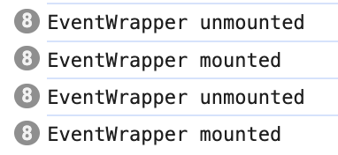

# react-big-calendar components issue

Minimal reproduction of components remounting issue present in `react-big-calendar` since `2.9.1`.

## Try it

```
npm install
npm run start
```

1. Go to `http://localhost:1234/`
2. Now click on any event. Look at the console. You will notice that **each calendar event gets remounted several times (unmounted and mounted again)**.



This has negative impacts:

- Performance issue – unmounted components gets removed from the DOM. So there is a lot of unnecessary DOM operations.
- It breaks components lifecycle – see the tooltip that "blinks" on each click. That happens because one tooltips destroys on unmount and another appears on next mount.
- It breaks event handlers – click handler is never triggered because DOM element is destroyed between `mouseDown` and `mouseUp`.

## Cause

- We are using [Drag and drop addon](https://jquense.github.io/react-big-calendar/examples/?path=/docs/additional-examples-drag-and-drop--draggable-and-resizable)
- We define custom `EventWrapper` component ([properly memoized](https://github.com/Poky85/demo-react-big-calendar-issue/blob/2e64ffc6c99245262d0471af28d118500c682f65/src/Application.tsx#L13), see the source code).
- Since `react-big-calendar@2.9.1` there is an issue with `components` memoization ([see the code](https://github.com/jquense/react-big-calendar/compare/v1.9.0...v1.9.1#diff-c738fb7a202dfca92df5203012dbc02bffe6d0480f9cdb845883c70c15d4a9c6R101)). Components are recreated on each render.
